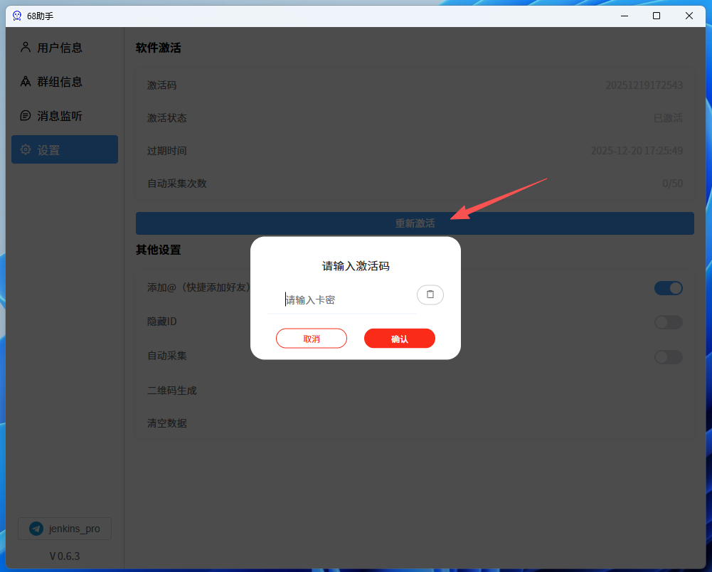

# 68助手使用说明
## 激活软件
使用软件前，请到`设置`中，激活软件



## 💰 价格表

| 服务类型 | 月付 | 季付（9折） | 年付（7折） |
|---------|------|------|------|
| 收取消息 | 80 U | 200 U | 660 U  |
| 收/发消息 | 150 U  | 405 U  | 1260 U |


## 联系客服购买卡密


## 连接websocket

客户端通过`ws://127.0.0.1:5599`连接到websocket服务，连接成功后，会返回：
```json
{
	"message": "Hello"
}
```
收到服务器回复后，代表连接成功。

> websocket数据通讯格式全部采用`json`格式

## 68消息回调

### 好友消息
```json
{
    "operator": "msgNew",
    "data": {
        "msgType": 0,
        "msgId": 2409462397,
        "sendUid": 4008697,
        "receiveUid": 7128348,
        "content": "Ffg",
        "sendTime": 1766116051970,
        "version": 6,
        "contentMd5": "ac716825f65e990167a446e9f1fd111d",
        "sendUser": {
            "uid": "4008697",
            "nickName": "ID采集机器人🤖",
            "icon": "http://r11.aiolet.xyz/common/pic/202507/27/44eff667aad9eaa434a0af55d9cd4048.jpg",
            "signature": "专业定制各类聊天软件自动化机器人",
            "identify": "k7m5tzmya2",
            "createTime": "1746527494000"
        },
        "customMsgId": "80499052521",
        "MsgID": 2409462397,
        "UserID": 4008697,
        "isSelf": false,
        "ChatType": 0,
        "chatType": 0,
        "id": 4008697,
        "friendId": 4008697,
        "time": 1766116051970,
        "type": "friend",
        "user": {
            "uid": "4008697",
            "nickName": "ID采集机器人🤖",
            "icon": "http://r11.aiolet.xyz/common/pic/202507/27/44eff667aad9eaa434a0af55d9cd4048.jpg",
            "signature": "专业定制各类聊天软件自动化机器人",
            "identify": "k7m5tzmya2",
            "createTime": "1746527494000"
        }
    }
}
```

### 群聊消息
```json
{
  "operator": "msgNew",
  "data": {
    "msgType": 0,
    "atUids": [],
    "atUsers": [],
    "sendUid": 7237423,
    "groupId": 389284,
    "content": "hhh",
    "sendTime": 1766115963742,
    "msgId": 4626337038,
    "sendMember": {
      "user": {
        "uid": "7237423",
        "nickName": "Pwgen",
        "icon": "http://r11.aiolet.xyz/common/pic/202509/06/d55d17285d3a7290c7dc953b25465722.jpg",
        "identify": "--",
        "createTime": "1746529904000"
      },
      "groupId": "389284",
      "score": "807415200000"
    },
    "contentMd5": "a6dc56281eb1b9f670ab84ec6fceeb44",
    "groupName": "huimei、🤖群成员ID采集机器人",
    "customMsgId": "20298293316",
    "MsgID": 4626337038,
    "UserID": 7237423,
    "isSelf": false,
    "ChatType": 0,
    "chatType": 0,
    "id": 389284,
    "name": "huimei、🤖群成员ID采集机器人",
    "sendUserName": "Pwgen：",
    "time": 1766115963742,
    "type": "group",
    "user": {
      "uid": "7237423",
      "nickName": "Pwgen",
      "icon": "http://r11.aiolet.xyz/common/pic/202509/06/d55d17285d3a7290c7dc953b25465722.jpg",
      "identify": "--",
      "createTime": "1746529904000"
    }
  }
}

```
#### 群组信息更新
```json
{
  "operator": "groupUpdate",
  "data": {
    "type": "group",
    "id": 389284,
    "values": {
      "name": "新的群名"
    }
  }
}
```

#### 开启/关闭群禁言
```json
{
  "operator": "msgNew",
  "operatorType": "groupShutupAll",
  "data": {
    "id": 389284,
    "time": 1766116603039,
    "sendTime": 1766116603039,
    "type": "group",
    "targetId": 0,
    "groupId": 389284,
    "content": "管理员开启了全员禁言/管理员关闭了全员禁言", 👈
    "operator": "message",
    "chatType": 50,
    "msgType": 50,
    "notificationType": "groupShutupAll",
    "bfShutup": true / false  👈
  }
}
```

#### 开启阅后即焚
```json
{
  "operator": "msgNew",
  "operatorType": "operatorReadCancel",
  "data": {
    "id": 389284,
    "time": 1766116668353,
    "sendTime": 1766116668353,
    "type": "group",
    "targetId": 0,
    "groupId": 389284,
    "content": "「管理員設定了訊息已讀30秒後銷毀」",
    "operator": "message",
    "chatType": 50,
    "msgType": 50,
    "notificationType": "operatorReadCancel"
  }
}
```

#### 关闭阅后即焚

```json
{
    "operator": "msgNew",
    "operatorType": "operatorReadCancel",
    "data": {
        "id": 389284,
        "time": 1766116798162,
        "sendTime": 1766116798162,
        "type": "group",
        "targetId": 0,
        "groupId": 389284,
        "content": "Pwgen  關閉了閱後即焚",
        "operator": "message",
        "chatType": 50,
        "msgType": 50,
        "notificationType": "operatorReadCancel"
    }
}
```